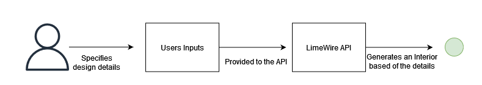
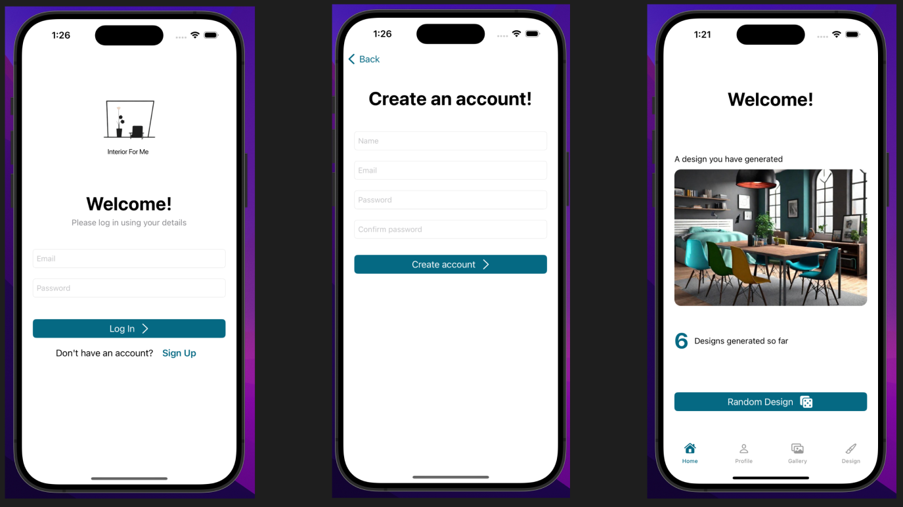

# Interior For Me

<!-- TABLE OF CONTENTS -->
<details open="open">
  <summary>Table of Contents</summary>
  <ol>
    <li><a href="#overview">Overview</a></li>
    <li>
      <a href="#getting-started">Getting Started</a>
      <ul>
        <li><a href="#prerequisites">Prerequisites</a></li>
        <li><a href="#installation">Installation</a></li>
      </ul>
    </li>
    <li><a href="#figma-prototype">Figma Prototype</a></li>
    <li><a href="#app-screenshots">Application Screens</a></li>
    <li><a href="#license">License</a></li>
    <li><a href="TODO.md">To-Do List</a></li>
  </ol>
</details>

<!-- Overview -->
## Overview

*Interior For Me is a fully functional iOS application that allows users to set their design preferences, generates an interior design based on those preferences, and provides options to view details, take notes, and more.*

Very High Level Application Diagram



Initial App Screens



<!-- GETTING STARTED -->
## Getting Started

### Prerequisites

The following are the requirements to run the code:

* Xcode 12 or later
* Swift 5.3 or later
* iOS 13.0 or later

### Installation

1. Clone the repo

   ```sh
   git clone https://github.com/leart-k/interior-for-me

## Figma Prototype


## App  Screenshots


## License

This project is licensed under the terms of the private license. No part of this project may be reproduced, distributed, or transmitted in any form or by any means, including photocopying, recording, or other electronic or mechanical methods, without the prior written permission of the owner, except in the case of brief quotations embodied in critical reviews and certain other noncommercial uses permitted by copyright law. Please contact me, to gain permission. 
